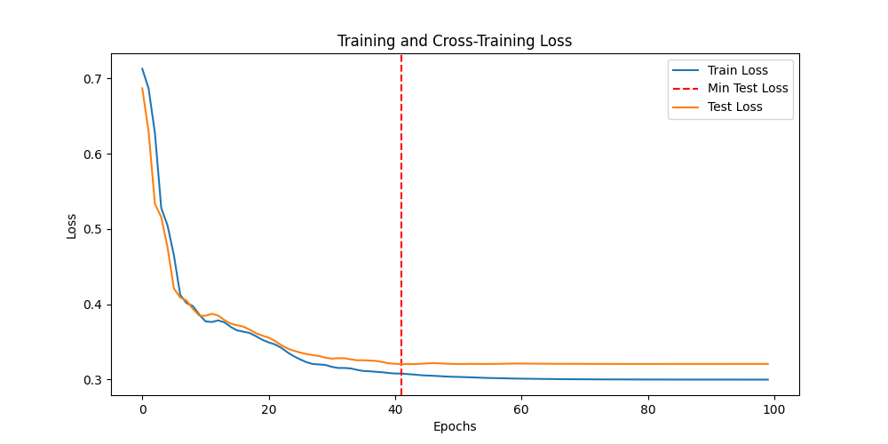

# Adult Income Classification with PyTorch MLP

## Project Description
This project aims to predict whether an individual's income exceeds $50K/year using the UCI Adult Income dataset. The workflow demonstrates best practices in data preprocessing, model design, training, and evaluation using PyTorch. The project emphasizes robust model selection using a cross-validation set, rather than relying solely on the test set, to ensure fair and unbiased performance estimation.

## Data Used
- **Dataset:** UCI Adult Income (Census Income) dataset
- **Source:** [UCI Machine Learning Repository](https://archive.ics.uci.edu/ml/datasets/adult)
- **Features:**
  - Categorical: workclass, education, marital.status, occupation, relationship, race, native.country, sex
  - Numerical: age, fnlwgt, education.num, capital.gain, capital.loss, hours.per.week
- **Target:** income (binary: >50K or <=50K)
- **Preprocessing:**
  - Cleaned and exported as `adult_cleaned.csv`
  - Categorical features one-hot encoded, numerical features standardized

## Model Architecture
- **Type:** Multi-Layer Perceptron (MLP) implemented in PyTorch
- **Layers:**
  - Input layer: size = number of processed features
  - Hidden layers: 4 layers with ReLU activations:
    - 250 → 180 → 100 → 25 units
  - Output layer: 1 neuron (binary classification)
- **Activations:**
  - ReLU for all hidden layers
  - No activation (sigmoid) in the model output; handled by `nn.BCEWithLogitsLoss`
- **Loss Function:** `nn.BCEWithLogitsLoss` 
- **Optimizer:** Adam (learning rate: 0.007, weight decay: 0.0006)
- **Scheduler:** ReduceLROnPlateau (adaptive learning rate, patience=5, factor=0.5)

## Model Selection Strategy
- **Cross-Validation Set:**
  - Instead of tuning and selecting models based on the test set, a dedicated cross-validation set is used.
  - The model with the best cross-validation performance is selected, ensuring the test set remains a true measure of generalization.
- **Why?**
  - This prevents overfitting to the test set and provides a more realistic estimate of model performance on unseen data.

## Threshold Tuning
- **Default threshold:** 0.5 (for binary classification)
- **Threshold tuned to** 0.2 based on precision and recall scores for 1 vs 0 cases

## Results & Metrics
### Final Model Performance
- **Test Set Accuracy:** ~0.8528
- **Cross-Validation Set Accuracy:** ~0.8519

### Classification Report (Test Set)
```
              precision    recall  f1-score   support

         0.0       0.86      0.95      0.90      3377
         1.0       0.80      0.55      0.65      1148

    accuracy                           0.84      4525
   macro avg       0.83      0.75      0.77      4525
weighted avg       0.84      0.84      0.83      4525
```

### Classification Report (Cross-Validation Set)
```
              precision    recall  f1-score   support

         0.0       0.86      0.95      0.90      3377
         1.0       0.80      0.55      0.65      1147

    accuracy                           0.84      4524
   macro avg       0.83      0.75      0.77      4524
weighted avg       0.84      0.84      0.83      4524
```




## Key Takeaways
- **Cross-validation set** is used for model selection and hyperparameter tuning, ensuring the test set is only used for final evaluation.
- **All metrics** (accuracy, precision, recall, F1-score, support) are reported for both test and cross-validation sets.
- **Loss curves** provide insight into model convergence and generalization.
- **Threshold tuning** is crucial for optimizing recall and F1-score for the minority class.

## How to Reproduce
1. Install dependencies: `pip install -r requirements.txt`
2. Run training: `python main.py`

---