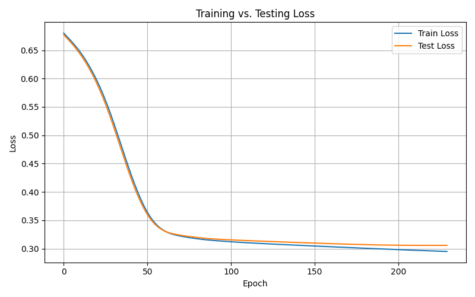
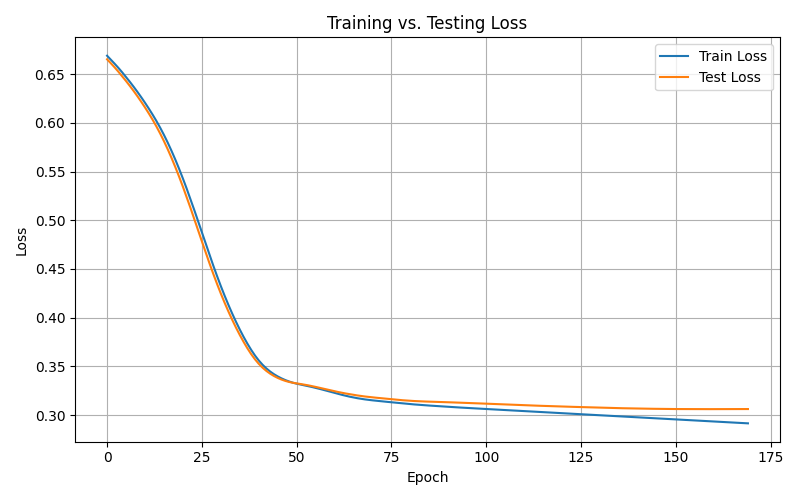
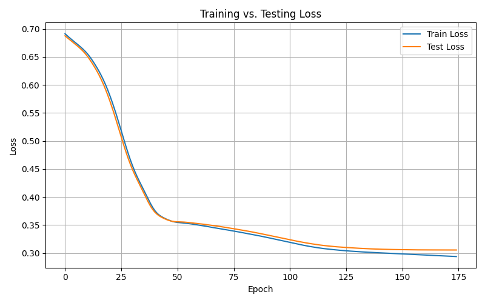
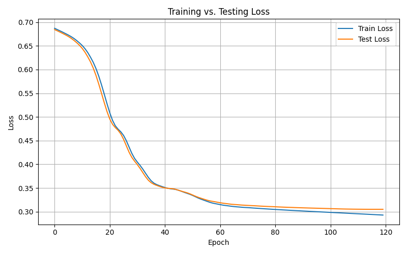

# PyTorch - Adult Income Census

We aim to predict individuals' income (a binary variable) using census data, where income is categorized as either >50K or ≤50K.

To perform this binary classification task, we train a neural network (specifically, a multi-layer perceptron). To identify the best-performing model, we ran multiple experiments, varying the number of layers, activation functions, learning rates, and number of training epochs.

Before diving in, let’s quickly walk through how to set this up on your computer.

## Project Setup

### Step 1: Clone the repository
Clone the repository by running the following command in your terminal or Git Bash:
```  
cd your_folder  
git clone "https://github.com/Awesome-AI-ML-DELTA25/PyTorch-AdultIncomeData.git"
cd PyTorch-AdultIncomeData
```

### Step 2: Install Conda (if not already installed)
Ensure you have installed either anaconda or miniconda.  
Link for installing: [Conda Download](https://www.anaconda.com/download/)

### Step 3: Create and activate the Conda environment

To set up the same virtual environment as used in this project, run the following command:  
` conda env create -f environment.yml `

Activate the environment:  
` conda activate weekIII_env `

### Step 4: Install required packages
 ` pip install -r /path/to/requirements.txt`


## Model Architecture & Workflow

The python files under 'src/' folder help create, train and execute the model.

1. load_data.py: This file handles preprocessing, enocding the data, seperating income and other columns, and finally splitting the data for training and testing followed by converting into 2-D tensors.
2. model.py: In this file, we decide the charactersticks of our model. The number of layers, dimensions of matrices for each layer, and the activation layer types are all decided here.
3. train.py: We have to now train the model created in the previous file. We find the loss for each run, and do a backward propogation to update the weights, and improve the model. For each epoch or run, we also find the performance of the model on test data. This helps us find the plateau, so we know the ideal number of epochs to prevent underfitting or overfitting.
4. plot.py: We plot the curve of accuracy of model on training and testing datasets with respect to the number of epochs.
5. evaluate.py: We find various characterstics like accuracy, F1 score etc.
6. main.py: The file which we execute providing the number of epochs and learning rate. It accordingly executes the above files in order. 

## Results

Before we go into detail, the below table shows the accuracy of various models with learning rate **0.001**.

| Model ID | Layers | Activations                                | Layer Dimensions                  | Epochs | Accuracy | Precision (1.0) | Recall (1.0) | F1-Score (1.0) |
|----------|----------|--------------------------------------------|-----------------------------------|--------|----------|------------------|---------------|----------------|
| M1       | 3        | relu, relu, sigmoid                        | 64 → 32 → 1                       | 230    | 0.8590   | 0.75             | 0.63          | 0.68           |
| M2       | 4        | relu, relu, relu, sigmoid                  | 100 → 50 → 25 → 1                 | 170    | 0.8571   | 0.75             | 0.63          | 0.68           |
| M3       | 5        | relu, relu, prelu, relu, sigmoid           | 128 → 64 → 32 → 16 → 1            | 175    | 0.8605  | 0.75             | 0.63          | 0.69           |
| M4       | 5        | relu, relu, relu, relu, sigmoid            | 128 → 64 → 32 → 16 → 1            | 175    | 0.8613  | 0.75             | 0.65          | 0.70           |
| M5       | 6        | relu, relu, relu, relu, relu, sigmoid      | 160 → 120 → 90 → 60 → 30 → 1      | 120    | 0.8602   | 0.75             | 0.64          | 0.69           |
| M6       | 6        | mish, mish, mish, mish, mish, sigmoid      | 160 → 120 → 90 → 60 → 30 → 1      | 295    | 0.8562   | 0.75             | 0.62          | 0.68           |

### Comparison Graph:

.png)


### Execution - 1

Layers: 3  
Activations: relu, relu, sigmoid  
Dimensions: 64 → 32 → 1  
Number of Epochs: 230  
Accuracy: 0.8590  



What happens when we increase the number of layers?

### Execution - 2

Layers: 4  
Activations: relu, relu, relu, sigmoid  
Dimensions: 100 → 50 → 25 → 1  
Number of Epochs: 170  
Accuracy: 0.8571  



Well, the performance dipped, could it be because our dimensions jump is too large (like 100 to 50)?

Let us reduce this gap, and introduce prelu!

### Execution - 3

Layers: 5  
Activations: relu, relu, prelu, relu, sigmoid  
Dimensions: 128 → 64 → 32 → 16 → 1  
Number of Epochs: 175  
Accuracy: 0.8605  

.png)

The Parametric Rectified Linear Unit (PReLU) function is defined as:

$
f(x) = 
\begin{cases}
x, & \text{if } x > 0 \\
a \cdot x, & \text{if } x \leq 0
\end{cases}
$

where:
- \(x\) is the input,
- \(a\) is a learnable parameter controlling the slope for negative inputs.

We should see the performance when we have ReLU instead of PReLU, like we have usually had.
 

### Execution - 4

Layers: 5  
Activations: relu, relu, relu, relu, sigmoid  
Dimensions: 128 → 64 → 32 → 16 → 1  
Number of Epochs: 175  
Accuracy: 0.8613  

Turns our ReLU is better than PReLU (in this particual case). We should stick with relu.



Let's increase the number of layers again, last time it worked.

### Execution - 5

Layers: 6  
Activations: relu, relu, relu, relu, relu, sigmoid  
Dimensions: 160 → 120 → 90 → 60 → 30 → 1  
Number of Epochs: 120  
Accuracy: 0.8602  

The accuracy dipped, however its still better than a lot of executions till now.



Let us try something new, we keep using ReLU, let us find another activation layer.

### Execution - 6

Layers: 6  
Activations: mish, mish, mish, mish, mish, sigmoid  
Dimensions: 160 → 120 → 90 → 60 → 30 → 1  
Number of Epochs: 295  
Accuracy: 0.8562  

In this execution, we used mish.

Mish is a smooth, non-monotonic activation function designed to provide better performance than ReLU. However in our case, that doesn't seem to be the case.

The Mish activation function is defined as:

$$
\text{Mish}(x) = x \times \tanh(\ln(1 + e^x))
$$

where:
- $\ln$ is the natural logarithm,  
- $e^x$ is the exponential function,  
- $\tanh$ is the hyperbolic tangent function.

.png)


## Learning Rate

In the above executions, the learning rate was always 0.001, we are going to change that. We will modify the learning rate from Execution-4. We chose this execution since it had the best accuracy, hence we will look for ways to improve it's performance.

### Execution - 7

Learning Rate: 0.0005  

Layers: 5  
Activations: relu, relu, relu, relu, sigmoid  
Dimensions: 128 → 64 → 32 → 16 → 1  
Number of Epochs: 277  
Accuracy: 0.8593  

.png)

The accuracy fell down. This could because it got stuck in a local minima. We can't have a small learning rate at the start due to this.

To solve this issue, we are going for a variable learning rate, which decreases over time, or rather, epochs.


### Execution - 8

Learning Rate: Variable (Start: 0.001, factor: 0.5, patience: 5, mode: 'min')  

Layers: 5  
Activations: relu, relu, relu, relu, sigmoid  
Dimensions: 128 → 64 → 32 → 16 → 1  
Number of Epochs: 170  
Accuracy: 0.8610  

If you noticed, there are of numbers which we have given for learning rate.

We used a scheduler to have a variable learning rate, it's code looks like this:
`scheduler = torch.optim.lr_scheduler.ReduceLROnPlateau(optimizer, mode='min', factor=0.5, patience=5)`

mode = 'min' means to reduce the learning rate when the loss metric stops improving (we are minimizing loss).

factor = 0.5 means we reduce the learning rate by a factor of 0.5 (0.001 to 0.0005).

patience = 5 refers that if the metric doesn't improve for 5 epochs, then we will reduce the learning rate, as decided by the factor.

The inital learning rate in our case is 0.001.

.png)

The accuracy is second best till now, yet it couldn't beat Execution-4, which we modified to get this.

Well, let us try to change the inital starting learning rate to a higher number, since we might have been reaching a local minima (close to global minima) in the previous case.


### Execution - 9

Learning Rate: Variable (Start: 0.0015, factor: 0.5, patience: 5, mode: 'min')

Layers: 5  
Activations: relu, relu, relu, relu, sigmoid  
Dimensions: 128 → 64 → 32 → 16 → 1  
Number of Epochs: 200  
Accuracy: 0.8615  

We have got the best accuracy across all executions till now!

.png)


## Conclusion

Our best-performing model achieved an accuracy of 86.15% using a 5 layer architecture with ReLU activations, trained with a variable learning rate starting at 0.0015 and dynamically reduced based on validation loss plateauing. This configuration was well-balanced outperforming all other models and alternative activation functions like PReLU and Mish.

### Key takeaways from our experiments include:

- More layers don't always mean better performance, there's a sweet spot beyond which deeper networks risk overfitting or vanishing gradients (especially considering our model is a binary classifier).

- ReLU outperformed PReLU and Mish in our trials, which might suggest that simpler activation functions are sometimes more accurate in practice.

- Learning rate scheduling played a crucial role in achieving optimal performance. A higher initial learning rate combined with controlled decay helped the model escape local minima while converging efficiently.

This project solidifies the importance of iterative experimentation and informed hyperparameter tuning in building MLPs. While our current model performs well, future improvements might involve changing the architecture, or tweaking the hyper-parameters to improve performance

## Usage

How can you run this on your computer?

Well, run the following command on your terminal:

`python main.py --data-path dataset/adult_income_cleaned.csv --epochs 100 --lr 0.001`

You can only change the number of epochs and learning rate through this, and not the model itself, for that you will have to get your hand dirty with the code.


## Author
Aditey Nandan  