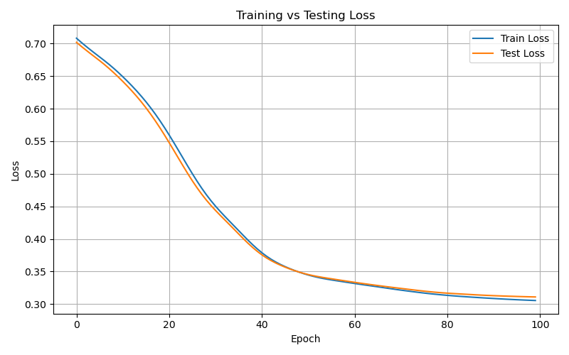
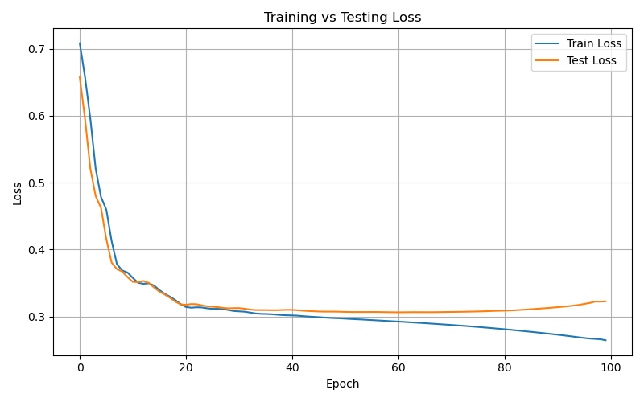
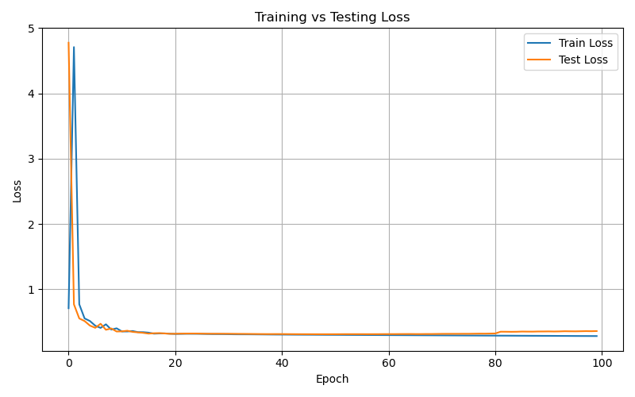

# Binary Classification on Adult Income Dataset using PyTorch

## 🔍 Project Overview

This project focuses on building a **binary classifier** using PyTorch to predict whether an individual's income exceeds \$50K/year based on census data.  
We use a **Multi-Layer Perceptron (MLP)** neural network and train it on the cleaned version of the **UCI Adult Income Dataset**.  

The main objectives of this project are:
- To preprocess real-world tabular data and prepare it for deep learning.
- To train a neural network to perform binary classification.
- To use modular coding practices by separating training, evaluation, plotting, and data loading into different Python files.

---

## ⚙️ Installation & Usage

### 1. Clone the Repository

git clone https://github.com/Awesome-AI-ML-DELTA25/PyTorch-AdultIncomeData.git
cd PyTorch-AdultIncomeData

### 2. Create & Activate Conda Environment
conda create -n income-pytorch python=3.12
conda activate income-pytorch

### 3. Install Dependencies
pip install -r requirements.txt

### 4. Run Training
e.g,
python main.py --data-path dataset/adult_income_cleaned.csv --epochs 50 --lr 0.001
(including data is optional if there is any error in your code)

## 📊 Loss Curve:
Blue line: Training loss over epochs

Orange line: Testing loss over epochs

The graph shows convergence and that the model generalizes well without overfitting

## 📈 Figures & Results
### 1.  Trial 1
python main.py --epochs 50 --lr 0.001

- **Accuracy**: 0.8451  
- **Precision**: 0.7171  
- **Recall**: 0.5880  
- **F1 Score**: 0.6462

🖼️ Ideal Training Behavior

    Observation: Both training and testing losses decrease smoothly and remain close throughout all 100 epochs.

    Interpretation:

        Excellent generalization — the model is learning patterns present in both training and validation sets.

        No overfitting or underfitting is visible.

    Conclusion: This is the best model among the three.

### 2.  Trial 2
python main.py --epochs 100 --lr 0.001

- **Accuracy**: 0.8568  
- **Precision**: 0.7402 
- **Recall**: 0.6238  
- **F1 Score**: 0.6770

🖼️ Overfitting Detected

    Observation: Training loss keeps decreasing steadily, while test loss starts increasing after ~30 epochs.

    Interpretation:

        The model is memorizing training data rather than generalizing.

        There's overfitting after a certain point due to excess training or too many parameters.

    Conclusion: Early stopping or regularization (dropout, weight decay) can beused to avoid this, but right now overfitted model

### 3.  Trial 3
python main.py --epochs 100 --lr 0.1

- **Accuracy**: 0.8582  
- **Precision**: 0.7504 
- **Recall**: 0.6153  
- **F1 Score**: 0.6762

🖼️ Poor Training Behavior

    Observation: Training and testing losses start extremely high (~4.5+) and drop sharply in the first few epochs. After that, both losses plateau almost instantly.

    Interpretation:

        The loss plummets due to learning some trivial pattern, but training halts due to a probable issue like too low learning rate, data quality, or model underfitting.

        Early stagnation indicates that the model isn't improving or learning complex patterns.

    Conclusion: Likely an unsuccessful training attempt — not ideal for reporting.
