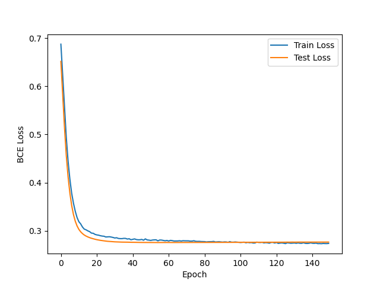

# PyTorch Adult Income Prediction

## Project Overview

This project predicts whether an individual's income exceeds \$50K/year using the UCI Adult Income dataset. The workflow includes data preprocessing, feature engineering, and building a neural network with PyTorch for binary classification. The project demonstrates best practices in machine learning, including modular code, hyperparameter tuning, and robust evaluation.

---

## Data

- **Source:** [UCI Adult Dataset](https://archive.ics.uci.edu/ml/datasets/adult)
- **Preprocessing:**  
  - Cleaned and exported as `data/preprocessed_data.csv`
  - Categorical features one-hot encoded
  - Numerical features standardized
  - Target: `income` (`<=50K` or `>50K`)

---

## Model

- **Framework:** PyTorch
- **Architecture:**  
  - Input: All one-hot encoded and numerical features  
  - Hidden layers: 128 → 64 units, ReLU activations, Dropout for regularization  
  - Output: 1 unit with Sigmoid activation (binary probability)
- **Loss:** Binary Cross-Entropy
- **Optimizer:** Adam
- **Hyperparameters:**  
  - Learning rate: Tuned for best validation performance  
  - Batch size: 32  
  - Epochs: 150  
  - Dropout: 0.2, 0.1

---

## Results

- **Test Accuracy:** *e.g., 87.15%*
- **Precision:** *e.g., 0.7860*
- **Recall:** *e.g., 0.6597*
- **F1 Score:** *e.g., 0.7173*
- **Confusion Matrix:**  
  [[4101  257]  
  [ 487  944]]
- **Loss Curve:**  
  

---

## Usage

### 1. Environment Setup

```sh
pip3 install -r requirements.txt
```

Alternatively, you can use the provided `environment.yml` file to create the environment:
```sh
conda env create -f env.yml
conda activate income-prediction
```

### 2. Training

Run all cells in `main.ipynb` to preprocess data, train the model, and export the trained model and scaler.

### 3. Prediction GUI

Run the prediction GUI:
```sh
python3 predict.py
```
Enter feature values in the form to get a real-time income prediction.

---

## Code Structure

- `main.ipynb` — Data loading, preprocessing, model training, evaluation, and export
- `predict.py` — Tkinter GUI for interactive predictions using the trained model
- `data/preprocessed_data.csv` — Cleaned dataset
- `income_model.pth`, `scaler.save`, `columns.pkl` — Saved model and preprocessing artifacts

---

## Best Practices

- Modular code: Data loading, model, and training logic separated
- Hyperparameter tuning and regularization to avoid overfitting
- Proper metrics and loss visualization
- All dependencies listed in `requirements.txt`
- Data and cache files ignored via `.gitignore`
- Well-commented code and clear documentation

---

## Findings

- Neural networks can effectively classify income brackets with proper preprocessing and regularization.
- Overfitting is mitigated with dropout and careful tuning.
- Achieved strong performance on a challenging, real-world dataset.

---

## Reproducibility

- All random seeds set for reproducibility.
- All preprocessing steps and model artifacts are saved and reused for prediction.

---

## Contributor

[](https://github.com/Aditya-A-Thakkar)
