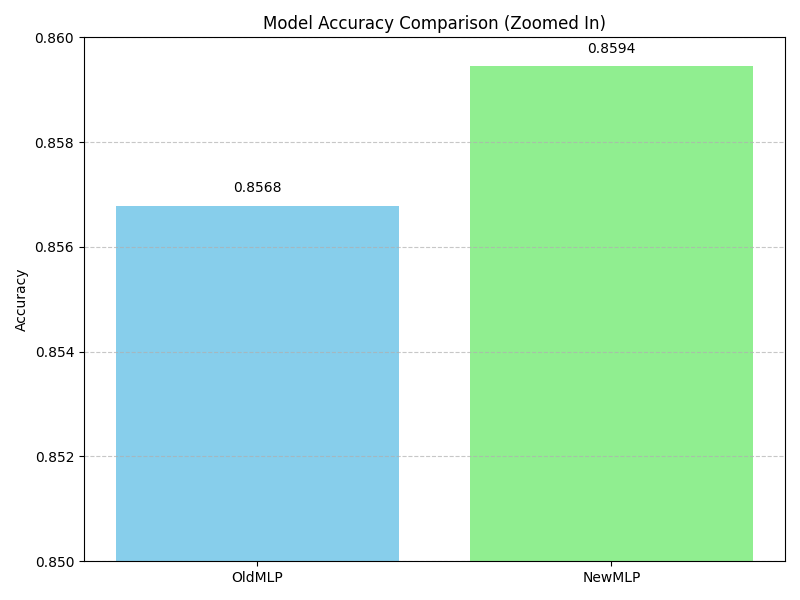
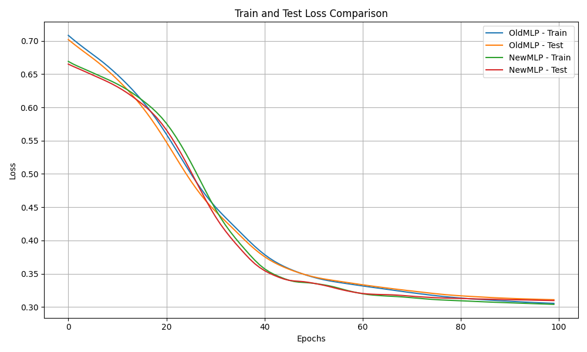
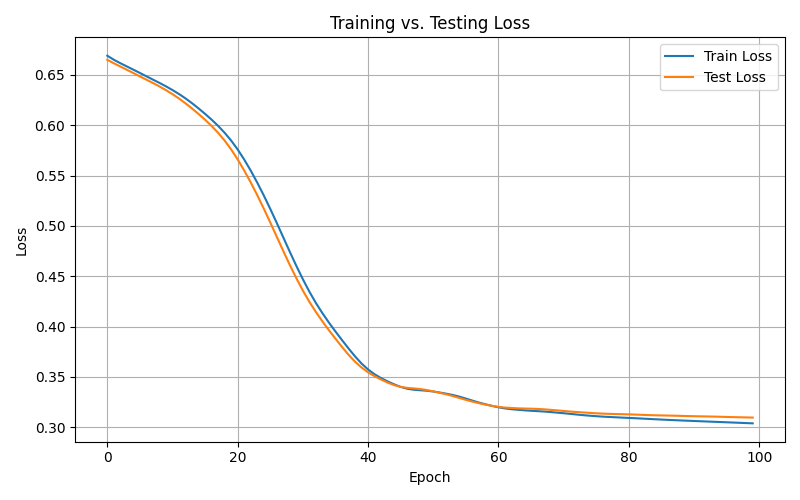
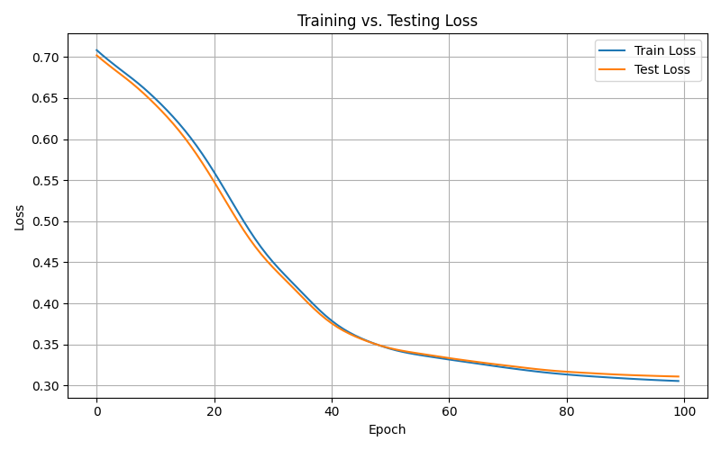

<!-- # To Do
- Create a conda environment to store the packages
- Export the data that you cleaned in the previous project (you can use your own cleaned data or someone else's) as a CSV file
- Use PyTorch to create a neural network of your choice to perform a regression task
- Train the model on the data you exported
- Use different python files to separate the different parts of your code
- Choose good hyperparameters
- Ensure best practices
- Report proper metrics, along with graph showing training and test loss with epochs
- Work solo or in pairs
- Ensure that your code is well commented
- Create a README file to explain your project, your process, and your findings
- Make sure to include the following in your README:
  - A description of the project
  - The data you used
  - The model you created
  - The results you obtained
- Make sure to not commit __pycache__ files
- Create a requirements.txt file to document the packages you used
- Create a .gitignore file to ignore the data files
- Create a branch for your project on this repository

The best project will be merged into the main branch for showcase! Good luck! -->

# Adult Income Classifier using MLP (PyTorch)
This project uses a Multi-Layer Perceptron (MLP) built with PyTorch to predict whether an individual's income exceeds $50K/year based on demographic attributes. The model is trained and evaluated on the UCI Adult Income Dataset.

## 🚀 How to Run
- Clone the repository:
- Install the required packages:
  ```bash
  pip install -r requirements.txt
  ```
- Run the main script:
  ```bash
  python main.py
  ```

## Dataset
The dataset used is the [UCI Adult Income Dataset](https://archive.ics.uci.edu/ml/datasets/adult), which contains demographic information such as age, education, occupation, and marital status. The target variable is whether the individual's income exceeds $50K/year.

## Models

### 🧓 OldMLP
- **Layers**:  
  `input → 100 → 50 → 25 → 1`  
- **Activations**: ReLU in all hidden layers, Sigmoid at output

### 🆕 NewMLP
- **Layers**:  
  `input → 128 → 64 → 32 → 16 → 1`  
- **Activations**: ReLU in all hidden layers, Sigmoid at output

Both models use `BCELoss` and are optimized using the `Adam` optimizer.

## 🏋️‍♂️ Training & Evaluation

Models are trained using the same dataset, learning rate, and number of epochs. The training pipeline:
1. Load and preprocess data
2. Define model and optimizer
3. Train on training set and validate on test set
4. Save model and generate plots

## 📈 Results

The `graphs/` folder contains comparisons of both models:

### 🔍 Accuracy Comparison (Zoomed In)


This bar graph compares the final test accuracy of the two models.  
Although both models perform similarly, **NewMLP** slightly outperforms **OldMLP**, achieving an accuracy of **~0.8594** versus **~0.8568**.

---

### 📉 Train vs Test Loss (Both Models)


This line graph shows the training and testing loss for **OldMLP** and **NewMLP** over 100 epochs.  
**NewMLP** demonstrates slightly faster convergence and more consistent learning, indicating better generalization.

---

### 🧠 NewMLP: Loss Curve


This curve illustrates how **NewMLP** reduces training and test loss over epochs.  
It converges smoothly with minimal overfitting, showcasing good training dynamics.

---

### 🧠 OldMLP: Loss Curve


The loss curve for **OldMLP** also shows stable convergence, but slightly higher final loss than **NewMLP**, especially on the test set.  
This supports the accuracy difference observed earlier.

## 📋 Model Metrics Comparison

| Metric                      | OldMLP   | NewMLP  |
|----------------------------|----------|---------|
| ✅ Final Test Accuracy      | 0.8568   | 0.8594  |
| 🔍 Precision (Class 0)      | 0.89     | 0.89    |
| 🔍 Precision (Class 1)      | 0.74     | 0.75    |
| 📈 Recall (Class 0)         | 0.93     | 0.94    |
| 📈 Recall (Class 1)         | 0.62     | 0.62    |
| 🎯 F1-Score (Class 0)       | 0.91     | 0.91    |
| 🎯 F1-Score (Class 1)       | 0.68     | 0.68    |
| 📊 Macro Avg F1-Score       | 0.79     | 0.79    |
| 📊 Weighted Avg F1-Score    | 0.85     | 0.85    |

> 📝 **Note:** Both models perform similarly overall, but **NewMLP** consistently shows slight improvements in accuracy and precision for Class 1 (positive class), which is often more important in imbalanced datasets like this.

## ✅ Conclusion

This project successfully demonstrates the use of Multi-Layer Perceptrons (MLPs) for binary classification using the UCI Adult Income dataset. Both the OldMLP and NewMLP architectures achieved strong performance, with **NewMLP** slightly outperforming **OldMLP** in terms of accuracy and precision for the positive class.

While the improvement is marginal, it highlights how deeper networks with more neurons can lead to better generalization — even with relatively simple tabular datasets. The project also followed good engineering practices by separating code, visualizing training dynamics, and reporting key metrics.

---
